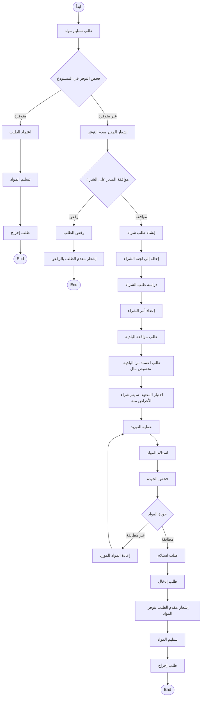

---
{"dg-publish":true,"permalink":"/diagram/mkhtt-activity/","dg-note-properties":{}}
---


# معالجة الشكاوى
```mermaid
flowchart TD
    %% ============================================
    %% Activity Diagram - Complaint Workflow
     ============================================
    %% Activity Diagram - Excavation Permit Workflow
    %% ============================================

    Start([ابدأ]) --> SubmitRequest[تقديم طلب رخصة حفر]
    
    SubmitRequest --> ForwardToDirector[إحالة إلى رئيس المديرية]
    
    ForwardToDirector --> DirectorDecision{قرار رئيس المديرية}
    
    DirectorDecision -->|رفض| Reject[رفض الطلب]
    Reject --> NotifyCitizen[إشعار المواطن بالرفض]
    NotifyCitizen --> End1([End])
    
    DirectorDecision -->|قبول| AssignToMonitor[تحويل إلى المراقب المختص]
    
    AssignToMonitor --> MonitorInspection[الكشف الميداني من المراقب]
    
    MonitorInspection --> MonitorDecision{موافقة المراقب}
    
    MonitorDecision -->|رفض| Reject2[رفض الطلب]
    Reject2 --> NotifyCitizen2[إشعار المواطن بالرفض]
    NotifyCitizen2 --> End2([End])
    
    MonitorDecision -->|موافقة| CheckServices{موافقات الجهات الخدمية}
    
    CheckServices -->|رفض| Reject3[رفض الطلب]
    Reject3 --> NotifyCitizen3[إشعار المواطن بالرفض]
    NotifyCitizen3 --> End3([End])
    
    CheckServices -->|موافقة| CalculateFees[حساب الرسوم]
    
    CalculateFees --> SendToFinance[إرسال إلى المالية]
    
    SendToFinance --> PayFees[دفع الرسوم في المالية]
    
    PayFees --> VerifyPayment{تأكيد الدفع}
    
    VerifyPayment -->|غير مدفوع| PayFees
    
    VerifyPayment -->|مدفوع| IssuePermit[إصدار إجازة الحفر]
    
    IssuePermit --> PermitPrint[طباعة الإجازة]
    
    PermitPrint --> DeliverToCitizen[تسليم الإجازة للمواطن]
    
    DeliverToCitizen --> End4([End])
```


# طلب تسليم مواد + شراء مواد

