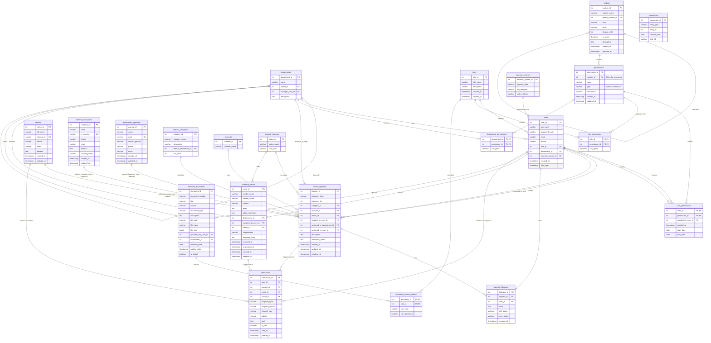

---
{"dg-publish":true,"permalink":"/diagram/mkhtt-erd-mermaid/","dg-note-properties":{}}
---

```mermaid
erDiagram
    %% =============================================
    %% 1. CORE STRUCTURE (Security & Organization)
    %% =============================================
    modules {
        int module_id PK
        varchar module_name
        int parent_module_id FK
        varchar icon
        varchar route
        int display_order
        boolean is_active
        text description
        timestamp created_at
        timestamp updated_at
    }

    departments {
        int department_id PK
        varchar name
        int parent_id FK
        int manager_user_id FK
        text description
    }

    roles {
        int role_id PK
        varchar role_name
        varchar description
        timestamp created_at
        timestamp updated_at
    }

    permissions {
        int permission_id PK
        int module_id FK "NULL for resources"
        varchar name
        varchar type "action or resource"
        varchar description
        timestamp created_at
        timestamp updated_at
    }

    external_systems {
        int external_system_id PK
        varchar system_name
        varchar api_endpoint
        varchar auth_method
    }

    users {
        int user_id PK
        varchar username
        varchar password_hash
        varchar email
        varchar phone
        int role_id FK
        int department_id FK
        int external_system_id FK
        timestamp created_at
        timestamp last_login
    }

    user_permissions {
        int user_id PK, FK
        int permission_id PK, FK
        int granted_by_user_id FK
        timestamp granted_at
        date start_date
        date end_date
    }

    role_permissions {
        int role_id PK, FK
        int permission_id PK, FK
        boolean can_grant
    }

    department_permissions {
        int department_id PK, FK
        int permission_id PK, FK
        boolean can_grant
    }

    %% =============================================
    %% 2. REQUESTER ENTITIES (Master Data)
    %% =============================================
    citizens {
        int citizen_id PK
        varchar full_name
        varchar national_id UK
        varchar phone
        varchar email
        text address
        timestamp created_at
        timestamp updated_at
    }

    external_companies {
        int company_id PK
        varchar name
        varchar cr_number UK
        varchar phone
        varchar email
        text address
        varchar contact_person
        timestamp created_at
        timestamp updated_at
    }

    government_agencies {
        int agency_id PK
        varchar name
        varchar code UK
        varchar contact_person
        varchar phone
        varchar email
        timestamp created_at
        timestamp updated_at
    }

    %% =============================================
    %% 3. CITIZEN REQUESTS (Polymorphic)
    %% =============================================
    request_categories {
        int category_id PK
        varchar category_name
        varchar description
        int default_department_id FK
        int sla_hours
    }

    channels {
        int channel_id PK
        varchar channel_name
    }

    request_statuses {
        int status_id PK
        varchar status_name
        varchar color_hex
    }

    citizen_requests {
        int request_id PK
        varchar requester_type
        int requester_id
        int category_id FK
        int channel_id FK
        int status_id FK
        int created_by_user_id FK
        int assigned_to_department_id FK
        int assigned_to_user_id FK
        text description
        text resolution_notes
        timestamp created_at
        timestamp updated_at
        timestamp resolved_at
    }

    request_followups {
        int followup_id PK
        int request_id FK
        int user_id FK
        text note
        varchar old_status
        varchar new_status
        timestamp created_at
    }

    %% =============================================
    %% 4. INCOMING EMAILS
    %% =============================================
    incoming_emails {
        int email_id PK
        varchar sender_email
        varchar sender_name
        varchar subject
        text body
        text attachment_links
        int department_id FK
        int assigned_to_user_id FK
        int status_id FK
        varchar classification
        text response_body
        timestamp received_at
        timestamp responded_at
        timestamp created_at
        timestamp updated_at
    }

    %% =============================================
    %% 5. DIGITAL ARCHIVE
    %% =============================================
    archived_documents {
        int document_id PK
        varchar document_number
        varchar title
        varchar source
        varchar document_type
        text description
        varchar file_path
        varchar file_hash
        bigint file_size
        int uploaded_by_user_id FK
        int department_id FK
        date received_date
        timestamp archive_date
        boolean is_digital
    }

    document_access_control {
        int document_id PK, FK
        int role_id PK, FK
        boolean can_view
        boolean can_download
    }

    %% =============================================
    %% 6. NOTIFICATIONS
    %% =============================================
    notifications {
        int notification_id PK
        int user_id FK
        int request_id FK
        int email_id FK
        int citizen_id FK
        varchar recipient_type
        varchar recipient_contact
        varchar channel_type
        varchar subject
        text body
        boolean is_sent
        timestamp sent_at
        timestamp created_at
    }

    %% =============================================
    %% 7. AUDIT LOG
    %% =============================================
    transactions {
        int transaction_id PK
        varchar entity_type
        int entity_id
        date created_date
        varchar field_71
    }

    %% =============================================
    %% RELATIONSHIPS
    %% =============================================
    %% Self-referencing
    modules ||--o{ modules : "has child"
    departments ||--o{ departments : "has child"

    %% Modules to Permissions
    modules ||--o{ permissions : "contains"

    %% Departments to Users
    departments ||--o{ users : "has"

    %% Roles to Users
    roles ||--o{ users : "assigns"

    %% External Systems to Users
    external_systems ||--o{ users : "authenticates via"

    %% Permission assignments
    users ||--o{ user_permissions : "receives"
    permissions ||--o{ user_permissions : "defines"
    users ||--o{ user_permissions : "grants"

    roles ||--o{ role_permissions : "includes"
    permissions ||--o{ role_permissions : "applies to role"

    departments ||--o{ department_permissions : "inherits"
    permissions ||--o{ department_permissions : "applies to dept"

    %% Polymorphic Relationships (Logical, not enforced by FK)
    citizens ||--o{ citizen_requests : "submits (requester_type = 'citizen')"
    external_companies ||--o{ citizen_requests : "submits (requester_type = 'company')"
    government_agencies ||--o{ citizen_requests : "submits (requester_type = 'agency')"

    %% Request references
    request_categories ||--o{ citizen_requests : "classifies"
    channels ||--o{ citizen_requests : "uses"
    request_statuses ||--o{ citizen_requests : "has status"
    users ||--o{ citizen_requests : "creates"
    departments ||--o{ citizen_requests : "assigned_to_dept"
    users ||--o{ citizen_requests : "assigned_to_user"

    %% Followups
    citizen_requests ||--o{ request_followups : "logs"
    users ||--o{ request_followups : "writes"

    %% Emails
    departments ||--o{ incoming_emails : "receives"
    users ||--o{ incoming_emails : "handles"
    request_statuses ||--o{ incoming_emails : "state"

    %% Archive
    users ||--o{ archived_documents : "uploads"
    departments ||--o{ archived_documents : "owns"
    archived_documents ||--o{ document_access_control : "restricts"
    roles ||--o{ document_access_control : "permitted"

    %% Notifications
    users ||--o{ notifications : "receives as employee"
    citizens ||--o{ notifications : "receives as citizen"
    citizen_requests ||--o{ notifications : "triggers request"
    incoming_emails ||--o{ notifications : "triggers email"
```