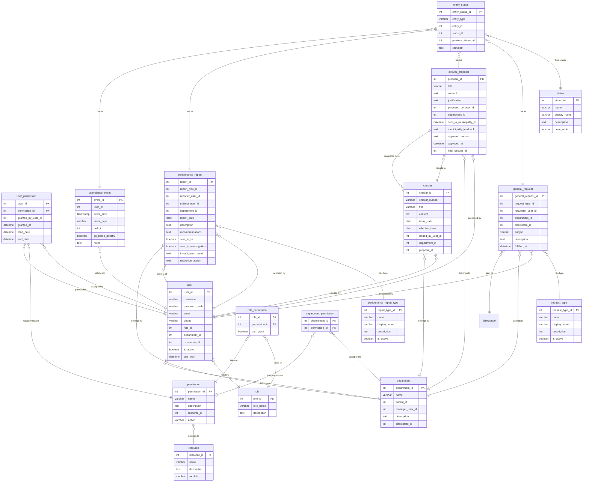

---
{"dg-publish":true,"permalink":"/alaqsam/alidary/mkhtt-erd-mermaid-alidary/","dg-note-properties":{}}
---

```mermaid
erDiagram
    %% ============================================
    %% CORE LOOKUP TABLES
    %% ============================================
    status {
        int status_id PK
        varchar name
        varchar display_name
        text description
        varchar color_code
    }

    request_type {
        int request_type_id PK
        varchar name
        varchar display_name
        text description
        boolean is_active
    }

    performance_report_type {
        int report_type_id PK
        varchar name
        varchar display_name
        text description
        boolean is_active
    }

    %% ============================================
    %% USERS & STRUCTURE
    %% ============================================
    user {
        int user_id PK
        varchar username
        varchar password_hash
        varchar email
        varchar phone
        int role_id
        int department_id
        int directorate_id
        boolean is_active
        datetime last_login
    }

    role {
        int role_id PK
        varchar role_name
        text description
    }

    department {
        int department_id PK
        varchar name
        int parent_id
        int manager_user_id
        text description
        int directorate_id
    }

    resource {
        int resource_id PK
        varchar name
        text description
        varchar module
    }

    permission {
        int permission_id PK
        varchar name
        text description
        int resource_id
        varchar action
    }

    role_permission {
        int role_id PK
        int permission_id PK
        boolean can_grant
    }

    user_permission {
        int user_id PK
        int permission_id PK
        int granted_by_user_id
        datetime granted_at
        datetime start_date
        datetime end_date
    }

    department_permission {
        int department_id PK
        int permission_id PK
    }

    %% ============================================
    %% ATTENDANCE
    %% ============================================
    attendance_event {
        int event_id PK
        int user_id
        timestamp event_time
        varchar event_type
        int task_id
        boolean go_home_directly
        text notes
    }

    %% ============================================
    %% GENERAL REQUESTS
    %% ============================================
    general_request {
        int general_request_id PK
        int request_type_id
        int requester_user_id
        int department_id
        int directorate_id
        varchar subject
        text description
        datetime fulfilled_at
    }

    %% ============================================
    %% CIRCULARS & PROPOSALS
    %% ============================================
    circular_proposal {
        int proposal_id PK
        varchar title
        text content
        text justification
        int proposed_by_user_id
        int department_id
        datetime sent_to_municipality_at
        text municipality_feedback
        text approved_version
        datetime approved_at
        int final_circular_id
    }

    circular {
        int circular_id PK
        varchar circular_number
        varchar title
        text content
        date issue_date
        date effective_date
        int issued_by_user_id
        int department_id
        int proposal_id
    }

    %% ============================================
    %% PERFORMANCE REPORTS
    %% ============================================
    performance_report {
        int report_id PK
        int report_type_id
        int reporter_user_id
        int subject_user_id
        int department_id
        date report_date
        text description
        text recommendations
        boolean sent_to_hr
        boolean sent_to_investigation
        text investigation_result
        text resolution_action
    }

    %% ============================================
    %% UNIVERSAL STATUS TRACKING
    %% ============================================
    entity_status {
        int entity_status_id PK
        varchar entity_type
        int entity_id
        int status_id
        int previous_status_id
        text comment
    }

    %% ============================================
    %% RELATIONSHIPS
    %% ============================================
    user }o--|| role : "has role"
    user }o--|| department : "belongs to"

    role_permission }o--|| role : "links to"
    role_permission }o--|| permission : "links to"
    user_permission }o--|| user : "assigned to"
    user_permission }o--|| permission : "has permission"
    user_permission }o--|| user : "granted by"
    department_permission }o--|| department : "assigned to"
    department_permission }o--|| permission : "has permission"
    permission }o--|| resource : "belongs to"

    attendance_event }o--|| user : "belongs to"

    general_request }o--|| request_type : "has type"
    general_request }o--|| user : "requested by"
    general_request }o--|| department : "belongs to"
    general_request }o--|| directorate : "sent to"

    circular_proposal }o--|| user : "proposed by"
    circular_proposal }o--|| department : "belongs to"
    circular_proposal }o--|| circular : "results in"

    circular }o--|| user : "issued by"
    circular }o--|| department : "belongs to"
    circular }o--|| circular_proposal : "originates from"

    performance_report }o--|| performance_report_type : "has type"
    performance_report }o--|| user : "reported by"
    performance_report }o--|| user : "subject of"
    performance_report }o--|| department : "belongs to"

    entity_status }o--|| status : "has status"
    entity_status }o--|| general_request : "tracks"
    entity_status }o--|| circular_proposal : "tracks"
    entity_status }o--|| performance_report : "tracks"
    entity_status }o--|| attendance_event : "tracks"
```