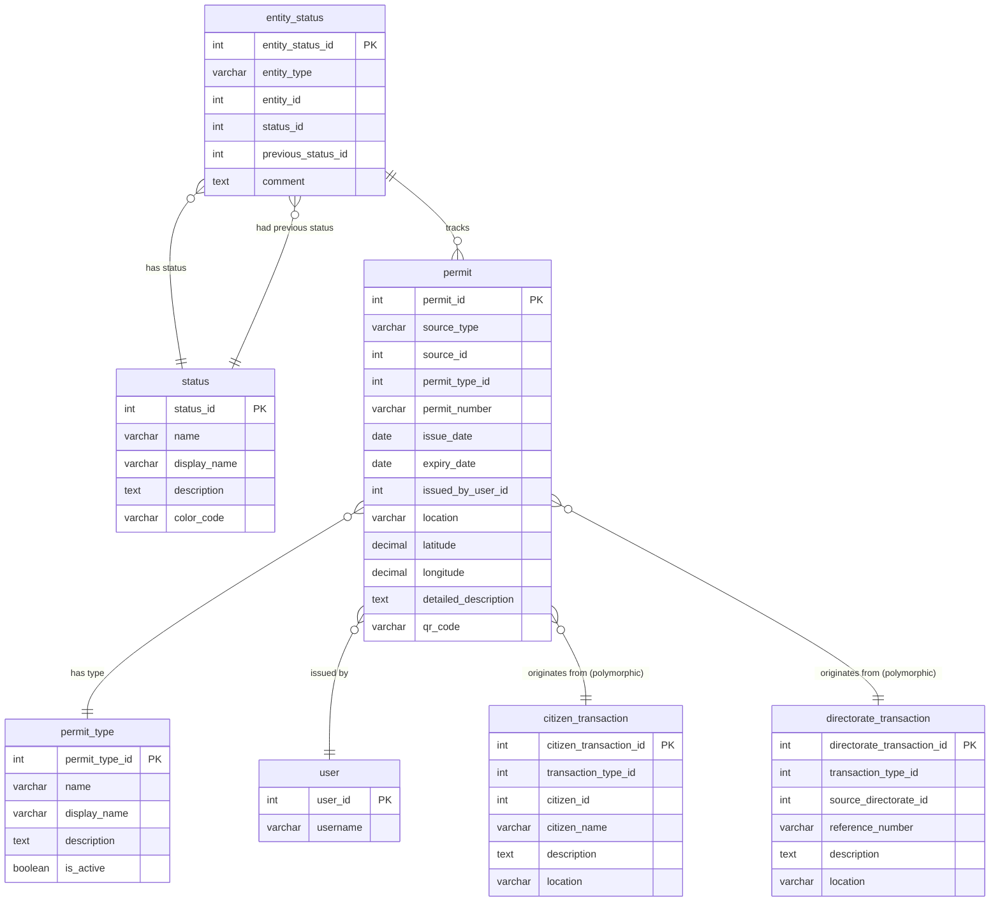

---
{"dg-publish":true,"permalink":"/alaqsam/alrkhs/mkhtt-erd-mermaid-alrkhs/","dg-note-properties":{}}
---

```mermaid
erDiagram
    %% ============================================
    %% PERMIT SECTION
    %% ============================================

    %% ============================================
    %% CORE LOOKUP
    %% ============================================
    permit_type {
        int permit_type_id PK
        varchar name
        varchar display_name
        text description
        boolean is_active
    }

    status {
        int status_id PK
        varchar name
        varchar display_name
        text description
        varchar color_code
    }

    %% ============================================
    %% TRANSACTION TABLES (Source)
    %% ============================================
    citizen_transaction {
        int citizen_transaction_id PK
        int transaction_type_id
        int citizen_id
        varchar citizen_name
        text description
        varchar location
    }

    directorate_transaction {
        int directorate_transaction_id PK
        int transaction_type_id
        int source_directorate_id
        varchar reference_number
        text description
        varchar location
    }

    %% ============================================
    %% PERMIT TABLES
    %% ============================================
    permit {
        int permit_id PK
        varchar source_type
        int source_id
        int permit_type_id
        varchar permit_number
        date issue_date
        date expiry_date
        int issued_by_user_id
        varchar location
        decimal latitude
        decimal longitude
        text detailed_description
        varchar qr_code
    }

    %% ============================================
    %% STATUS TRACKING (Global)
    %% ============================================
    entity_status {
        int entity_status_id PK
        varchar entity_type
        int entity_id
        int status_id
        int previous_status_id
        text comment
    }

    %% ============================================
    %% REFERENCED TABLES (Black Box - For Context)
    %% ============================================
    user {
        int user_id PK
        varchar username
    }

    %% ============================================
    %% RELATIONSHIPS
    %% ============================================
    permit }o--|| permit_type : "has type"
    permit }o--|| user : "issued by"

    permit }o--|| citizen_transaction : "originates from (polymorphic)"
    permit }o--|| directorate_transaction : "originates from (polymorphic)"

    entity_status }o--|| status : "has status"
    entity_status }o--|| status : "had previous status"
    entity_status ||--o{ permit : "tracks"
```