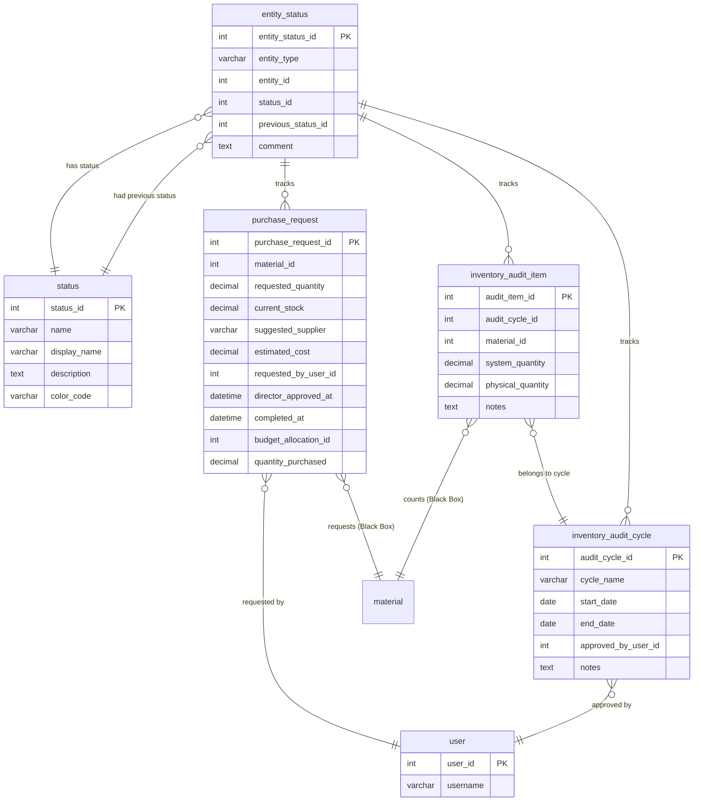

---
{"dg-publish":true,"permalink":"/alaqsam/almstwde/mkhtt-erd-mermaid-almstwde/","dg-note-properties":{}}
---

```mermaid
erDiagram
    %% ============================================
    %% WAREHOUSE SECTION
    %% ============================================

    %% ============================================
    %% CORE LOOKUP
    %% ============================================
    status {
        int status_id PK
        varchar name
        varchar display_name
        text description
        varchar color_code
    }

    %% ============================================
    %% PURCHASE REQUESTS
    %% ============================================
    purchase_request {
        int purchase_request_id PK
        int material_id
        decimal requested_quantity
        decimal current_stock
        varchar suggested_supplier
        decimal estimated_cost
        int requested_by_user_id
        datetime director_approved_at
        datetime completed_at
        int budget_allocation_id
        decimal quantity_purchased
    }

    %% ============================================
    %% INVENTORY AUDIT
    %% ============================================
    inventory_audit_cycle {
        int audit_cycle_id PK
        varchar cycle_name
        date start_date
        date end_date
        int approved_by_user_id
        text notes
    }

    inventory_audit_item {
        int audit_item_id PK
        int audit_cycle_id
        int material_id
        decimal system_quantity
        decimal physical_quantity
        text notes
    }

    %% ============================================
    %% STATUS TRACKING (Global)
    %% ============================================
    entity_status {
        int entity_status_id PK
        varchar entity_type
        int entity_id
        int status_id
        int previous_status_id
        text comment
    }

    %% ============================================
    %% REFERENCED TABLES (Black Box - For Context)
    %% ============================================
    user {
        int user_id PK
        varchar username
    }

    %% ============================================
    %% MATERIAL (Black Box)
    %% ============================================
    %% material {
    %%     int material_id PK
    %%     varchar name
    %% }

    %% ============================================
    %% RELATIONSHIPS
    %% ============================================
    purchase_request }o--|| user : "requested by"
    purchase_request }o--|| material : "requests (Black Box)"

    inventory_audit_item }o--|| inventory_audit_cycle : "belongs to cycle"
    inventory_audit_item }o--|| material : "counts (Black Box)"
    inventory_audit_cycle }o--|| user : "approved by"

    entity_status }o--|| status : "has status"
    entity_status }o--|| status : "had previous status"
    entity_status ||--o{ purchase_request : "tracks"
    entity_status ||--o{ inventory_audit_cycle : "tracks"
    entity_status ||--o{ inventory_audit_item : "tracks"
```