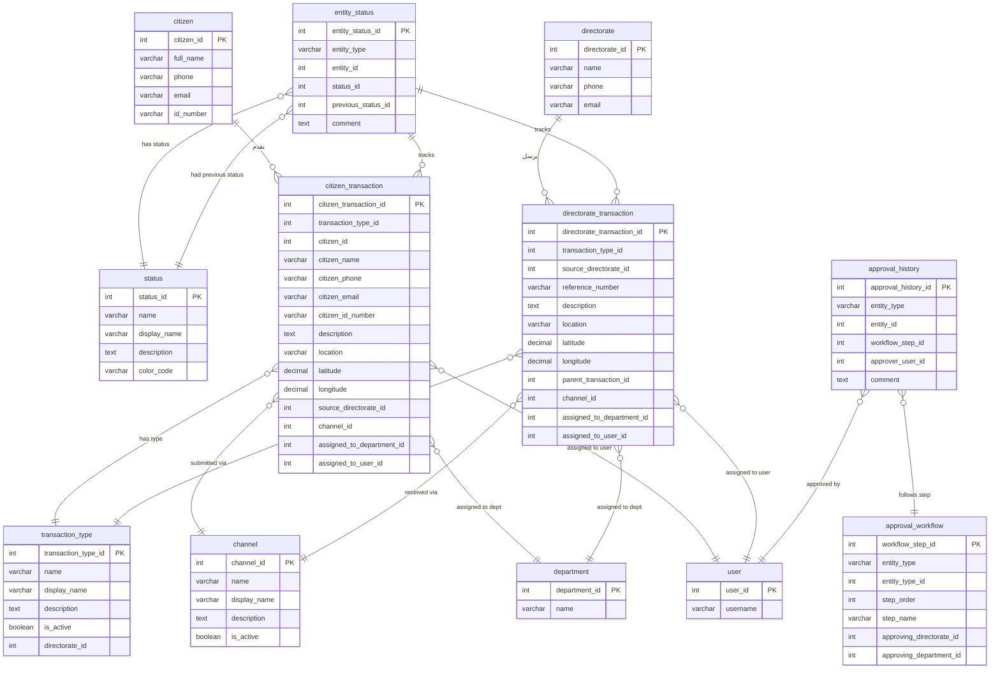

---
{"dg-publish":true,"permalink":"/alaqsam/almeamlat/mkhtt-erd-mermaid-almeamlat/","dg-note-properties":{}}
---

```mermaid
erDiagram
    %% ============================================
    %% CORE LOOKUP TABLES
    %% ============================================
    transaction_type {
        int transaction_type_id PK
        varchar name
        varchar display_name
        text description
        boolean is_active
        int directorate_id
    }

    channel {
        int channel_id PK
        varchar name
        varchar display_name
        text description
        boolean is_active
    }

    status {
        int status_id PK
        varchar name
        varchar display_name
        text description
        varchar color_code
    }

    %% ============================================
    %% ENTITY TABLES (Black Box)
    %% ============================================
    citizen {
        int citizen_id PK
        varchar full_name
        varchar phone
        varchar email
        varchar id_number
    }

    directorate {
        int directorate_id PK
        varchar name
        varchar phone
        varchar email
    }

    %% ============================================
    %% TRANSACTION TABLES
    %% ============================================
    citizen_transaction {
        int citizen_transaction_id PK
        int transaction_type_id
        int citizen_id
        varchar citizen_name
        varchar citizen_phone
        varchar citizen_email
        varchar citizen_id_number
        text description
        varchar location
        decimal latitude
        decimal longitude
        int source_directorate_id
        int channel_id
        int assigned_to_department_id
        int assigned_to_user_id
    }

    directorate_transaction {
        int directorate_transaction_id PK
        int transaction_type_id
        int source_directorate_id
        varchar reference_number
        text description
        varchar location
        decimal latitude
        decimal longitude
        int parent_transaction_id
        int channel_id
        int assigned_to_department_id
        int assigned_to_user_id
    }

    %% ============================================
    %% APPROVAL SYSTEM
    %% ============================================
    approval_workflow {
        int workflow_step_id PK
        varchar entity_type
        int entity_type_id
        int step_order
        varchar step_name
        int approving_directorate_id
        int approving_department_id
    }

    approval_history {
        int approval_history_id PK
        varchar entity_type
        int entity_id
        int workflow_step_id
        int approver_user_id
        text comment
    }

    %% ============================================
    %% STATUS TRACKING (Global)
    %% ============================================
    entity_status {
        int entity_status_id PK
        varchar entity_type
        int entity_id
        int status_id
        int previous_status_id
        text comment
    }

    %% ============================================
    %% REFERENCED TABLES (Black Box - For Context)
    %% ============================================
    user {
        int user_id PK
        varchar username
    }

    department {
        int department_id PK
        varchar name
    }

    %% ============================================
    %% RELATIONSHIPS
    %% ============================================
    citizen ||--o{ citizen_transaction : "يقدم"
    directorate ||--o{ directorate_transaction : "يرسل"

    citizen_transaction }o--|| transaction_type : "has type"
    citizen_transaction }o--|| channel : "submitted via"
    citizen_transaction }o--|| department : "assigned to dept"
    citizen_transaction }o--|| user : "assigned to user"

    directorate_transaction }o--|| transaction_type : "has type"
    directorate_transaction }o--|| channel : "received via"
    directorate_transaction }o--|| department : "assigned to dept"
    directorate_transaction }o--|| user : "assigned to user"

    approval_history }o--|| approval_workflow : "follows step"
    approval_history }o--|| user : "approved by"

    entity_status }o--|| status : "has status"
    entity_status }o--|| status : "had previous status"
    entity_status ||--o{ citizen_transaction : "tracks"
    entity_status ||--o{ directorate_transaction : "tracks"
```