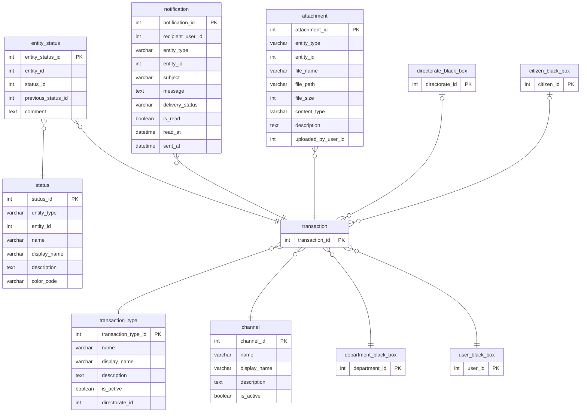

---
{"dg-publish":true,"permalink":"/alaqsam/alnafdht/mkhtt-erd-mermaid-alnafdht/","dg-note-properties":{}}
---

```mermaid
erDiagram
    %% ============================================
    %% CORE LOOKUP TABLES
    %% ============================================
    channel {
        int channel_id PK
        varchar name
        varchar display_name
        text description
        boolean is_active
    }

    transaction_type {
        int transaction_type_id PK
        varchar name
        varchar display_name
        text description
        boolean is_active
        int directorate_id
    }

    status {
        int status_id PK
        varchar entity_type
        int entity_id
        varchar name
        varchar display_name
        text description
        varchar color_code
    }

    %% ============================================
    %% ENTITY TABLES (Black Box)
    %% ============================================
    citizen_black_box {
        int citizen_id PK
    }

    directorate_black_box {
        int directorate_id PK
    }

    %% ============================================
    %% TRANSACTION TABLES (Core)
    %% ============================================
	transaction {
        int transaction_id PK
    }

    %% ============================================
    %% SHARED / CROSS-MODULE TABLES
    %% ============================================
    attachment {
        int attachment_id PK
        varchar entity_type
        int entity_id
        varchar file_name
        varchar file_path
        int file_size
        varchar content_type
        text description
        int uploaded_by_user_id
    }

    notification {
        int notification_id PK
        int recipient_user_id
        varchar entity_type
        int entity_id
        varchar subject
        text message
        varchar delivery_status
        boolean is_read
        datetime read_at
        datetime sent_at
    }

    %% ============================================
    %% STATUS TRACKING (Global)
    %% ============================================
    entity_status {
        int entity_status_id PK
        int entity_id
        int status_id
        int previous_status_id
        text comment
    }

    %% ============================================
    %% REFERENCED TABLES (Black Box - For Context)
    %% ============================================
    user_black_box {
        int user_id PK
    }

    department_black_box {
        int department_id PK
    }

    %% ============================================
    %% RELATIONSHIPS
    %% ============================================
    citizen_black_box |o--o{ transaction : ""
    directorate_black_box |o--o{ transaction : ""

    transaction }o--|| transaction_type : ""
    transaction }o--|| channel : ""
    transaction }o--|| department_black_box : ""
    transaction }o--|| user_black_box : ""

    attachment }o--|| transaction : ""

    notification }o--|| transaction : ""

    entity_status }o--|| status : ""
    entity_status }o--|| transaction : ""

```