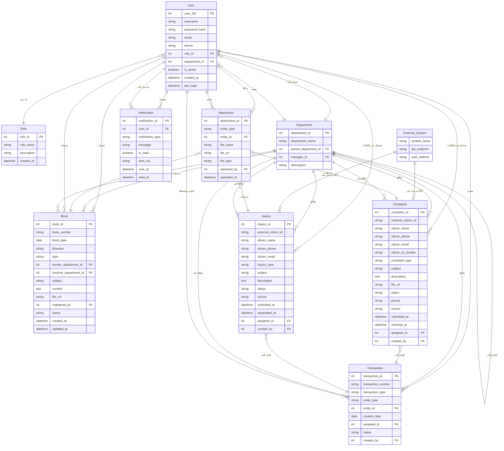

---
{"dg-publish":true,"permalink":"/qsm-alnafdht/mkhtt-erd/","dg-note-properties":{}}
---

```mermaid
erDiagram
    %% ============================================
    %% 1. مجموعة الديوان - الكيانات الأساسية
    %% ============================================

    %% الكيانات الداخلية (نظام المديرية)
    User {
        int user_id2 PK
        string username
        string password_hash
        string email
        string phone
        int role_id FK
        int department_id FK
        boolean is_active
        datetime created_at
        datetime last_login
    }

    Role {
        int role_id PK
        string role_name
        string description
        datetime created_at
    }

    Department {
        int department_id PK
        string department_name
        int parent_department_id FK
        int manager_id FK
        string description
    }

    Book {
        int book_id PK
        string book_number
        date book_date
        string direction
        string type
        int sender_department_id FK
        int receiver_department_id FK
        string subject
        text content
        string file_url
        int registered_by FK
        string status
        datetime created_at
        datetime updated_at
    }

    Complaint {
        int complaint_id PK
        string external_citizen_id
        string citizen_name
        string citizen_phone
        string citizen_email
        string citizen_id_number
        string complaint_type
        string subject
        text description
        string file_url
        string status
        string priority
        string source
        datetime submitted_at
        datetime resolved_at
        int assigned_to FK
        int created_by FK
    }

    Inquiry {
        int inquiry_id PK
        string external_citizen_id
        string citizen_name
        string citizen_phone
        string citizen_email
        string inquiry_type
        string subject
        text description
        string status
        string source
        datetime submitted_at
        datetime responded_at
        int assigned_to FK
        int created_by FK
    }

    Attachment {
        int attachment_id PK
        string entity_type
        int entity_id FK
        string file_name
        string file_url
        string file_type
        int uploaded_by FK
        datetime uploaded_at
    }

    Notification {
        int notification_id PK
        int user_id FK
        string notification_type
        string message
        boolean is_read
        string sent_via
        datetime sent_at
        datetime read_at
    }

    Transaction {
        int transaction_id PK
        string transaction_number
        string transaction_type
        string entity_type
        int entity_id FK
        date created_date
        int assigned_to FK
        string status
        int created_by FK
    }

    %% ============================================
    %% 2. الكيانات الخارجية (خارج نظام المديرية)
    %% ============================================

    External_System {
        string system_name
        string api_endpoint
        string auth_method
    }

    %% ============================================
    %% 3. العلاقات بين الكيانات
    %% ============================================

    %% User relationships
    User }o--|| Role : "له دور"
    User }o--|| Department : "ينتمي إلى"
    User ||--o{ Notification : "يستلم"
    User ||--o{ Book : "يسجل"
    User ||--o{ Attachment : "يرفع"
    User ||--o{ Transaction : "ينشئ"
    User ||--o{ Complaint : "يسجل عبر النافذة"
    User ||--o{ Inquiry : "يسجل عبر النافذة"

    %% Department relationships
    Department ||--o{ Book : "يرسل / يستقبل"
    Department ||--o{ Complaint : "يعالج"
    Department ||--o{ Inquiry : "يعالج"
    Department ||--o{ Transaction : "يعالج"
    Department ||--o{ User : "يضم"
    Department ||--o{ Department : "يتفرع إلى"

    %% External System relationships
    External_System ||--o{ Complaint : "يرسل عبر API"
    External_System ||--o{ Inquiry : "يرسل عبر API"

    %% Book relationships
    Book }o--|| User : "يسجله"
    Book }o--|| Department : "مرتبط بـ"

    %% Complaint relationships
    Complaint }o--|| Transaction : "تؤدي إلى"
    Complaint }o--|| Department : "تعالج في"

    %% Inquiry relationships
    Inquiry }o--|| Transaction : "تؤدي إلى"
    Inquiry }o--|| Department : "يعالج في"

    %% Attachment relationships
    Attachment }o--|| Complaint : "مرتبط بـ"
    Attachment }o--|| Inquiry : "مرتبط بـ"
    Attachment }o--|| Book : "مرتبط بـ"
    Attachment }o--|| User : "رفعه"

    %% Transaction relationships
    Transaction }o--|| Department : "يعالج في"
    Transaction }o--|| User : "أنشئ بواسطة"

    %% Notification relationships
    Notification }o--|| User : "مرسل إلى"
```